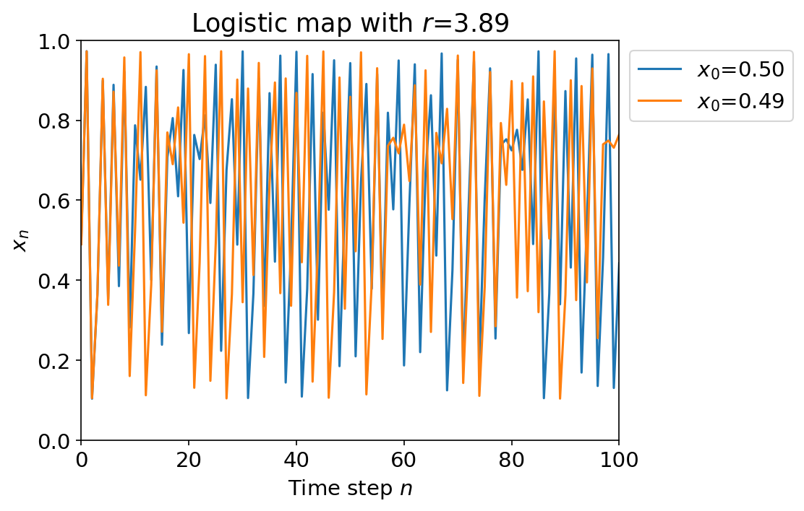

# New Thoughts

## Dynamical Systems
(Discrete) dynamical systems typically study sequences of continuous transformations applied to sets. 
For instance, you will see a lot of dynamical systems written as:
$$
x_{n+1} = f_n(x_n).
$$
One of the hallmarks of dynamical systems is that they are often chaotic.

Even the simplest dynamical systems can exhibit chaotic behavior.
We often see beautiful fractals and other interesting patterns emerge from periodic, quasiperiodic, ergodic, and chaotic dynamical systems.
Take for example the classical system called the *logistic map* which has the governing equation:
$$
x_{n+1} = rx_n(1-x_n) \qquad \textrm{ for } x_n \in [0,1] \textrm{ and } r \in [0,4].
$$
This system is often studied due to its simplicity in construction, but the presence of chaotic behavior.

Chaos is often defined as *sensitive dependence on initial conditions*.
In this sense, a chaotic system can seemingly behave randomly, but is actually deterministic.
This feels quite similar to the idea of a hash function.

In the figure above, we track the path of two different starting points $x_0 = 0.50$ and $x_0 = 0.49$. Their trajectories are seemingly random and uncorrelated due to choosing such a large value of $r$, but they are actually deterministic and governed by the same equation.

## Ergodicity
Ergodicity is a property of dynamical systems that essentially means that the system explore the space of possible states with equal probability over time.
Intuitively, its as if an *ergodic transformation* is a transformation that "mixes" or "stirs" the space of possible states in a way that is uniform.

The simplest example of an ergodic transformation is a rotation of the circle by some irrational angle (meaning not a fraction of $\pi$) $\theta$ (in radians). If we continuously apply the map:
$$
x_{n+1} = x_n + \theta \mod 1
$$
then we get a system that is ergodic.
We will continuously explore the entire circle with equal probability over long enough periods of times (iterations).

### Questions
- Dynamical systems typically works over the reals $\R$, but Poseidon works over a finite field $\mathbb{F}_p$. How does this change things? Is there a way to think about Poseidon as a dynamical system over $\mathbb{F}_p$ that is meaningful? Even just focusing on the S-boxes, can we think of them as dynamical systems over $\mathbb{F}_p$ in a way that shows these are close to, or are, "chaotic"?
- Also related was the notion of ergodicity. Can we think of Poseidon as an ergodic transformation over $\mathbb{F}_p$? What does this mean? Is this meaningful? What does this tell us about the security of Poseidon?
- Does thinking about POSEIDON as a dynamical system help us understand the security of the hash function? For instance, if we could show that POSEIDON is not ergodic and not chaotic, would this show a reduced security metric for the hash function? Or is this not meaningful? On the other hand, if we could show that POSEIDON is ergodic and chaotic, would this be validation of the current security metrics? Or is this not meaningful?